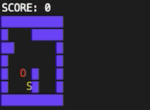

# Assignment 5 - Snake
Out Tuesday October 31, 2023

Due Tuesday November 21, 2023 11:59 am

## Introduction
### Objectives
* Understand how information is stored in memory
* Become familiar with C strings, bitwise operations, and dynamic memory allocation (`malloc` and `free`).
* Refresh your knowledge of using pointers
* Understand the difference between ASCII and Unicode character representations.

### Stencil Overview
Below is an outline of all the files we provide you with an a brief description of what they do:

In snake/src/:
| File			| Purpose  |
| ------------- | -------- |
| common.h		| Contains definitions for the input_key enum and snake struct, declarations for global variables defined in common.c, and function headers for common.c |
| game_over.h	| Contains function headers for game_over.c |
| game_setup.h	| Contains the definition for the board_init_status enum and function headers for game_setup.c |
| game.h		| Contains function headers for game.c |
| linked_list.h	| Contains the definition for the node struct and function headers for linked_list.h |
| mbstrings.h	| Contains function headers for mbstrings.c |
| render.h		| Contains function headers for render.c |
| snake.c		| Contains support functions and skeleton version of main |

In snake/test/:
| File			| Purpose  |
| ------------- | -------- |
| traces.json   | Contains all of the traces (i.e. test cases) that a working implementation will pass |
| autograder.c & autograder.py | Autograder program/scripting |

The files that you will have to modify in the project are:
* game.c
* game_setup.c
* snake.c
* linked_list.c
* mbstrings.c
* common.h
* common.c


## Overview
> **Important Note**: There are Testing and Debugging sections at the end of this handout. Make sure you read through these before attempting to implement any part of the project, so that you can run tests and productively debug your code.

### Game Rules
The rules of Snake are:
* The playing field is a 2d grid of squares
* The playing field is bordered by walls
* The playing field may have optional internal walls
* The snake is a series of one or more squares
* The player controls the direction of the snake using the arrow keys
* Food appears at random locations within the playing field
  * If the snake's head touches the food, the snake eats it
  * When the snake eats food, another piece of food appears at a different random location

Your task will be to take the stencil, which does nothing currently, and implement a game with these rules.

The stencil contains several helpful helper functions to get you started.

### Part 1 - Snake Movement and Board Setup
>**Task**: To start with, download the stencil code and run `make` to compile the stencil.  Then run `./snake` and `./snake 0` to see the output of the stencil.

```bash
$ make
$ ./snake
usage: snake <GROWS: 0|1> [BOARD STRING]
$ ./snake 0
             ____
Hello       / . .\
CSC412      \  ---<
student!     \  /
   __________/ /
-=:___________/
```

#### Part 1a - Board & Game Setup (focus here to pass Lab7 tests)
Like any computer program, the Snake game consists of machine code (in the “code” or “text” segment of memory) and data. The data represents the state of the game, as well as its visual representation to the player. All of this is stored in the computer’s memory in the form of bytes.

Your first task is to extend the stencil with the necessary code to represent and update the game state in memory!

We have already created the local variables you need to store information about the game board in the main function of snake.c. We have also already created you the global variables you need to represent high-level game information in `common.<c|h>`. You will need to fill in the variables necessary to store information about the snake.

First, we’ll give you an overview of the information stored on the board and game state. Then, you will come up with a representation for storing information about the snake.

##### Board Data
Here are the board variables that we give you in the stencil (located in main in snake.c):

```C
// Board data
size_t width; 
size_t height;
int* cells;  // array of integers containing data for each cell on the board
```

We have included both a `width` variable and a `height` variable to store the dimensions of the board. Notice that both of these variables have type `size_t`. This particular type actually represents values of type `unsigned long`, but we use the type definition `size_t` to indicate that the corresponding value represents a “size” of some other kind of data. In this case, we use `size_t` for our `width` and `height` to indicate that we are storing two size measurements of our board. To disambiguate between `width` and `height`, we will consider `width` to be the number of columns in a board and `height` to be the number of rows.

`cells` is what we use to represent the actual game board. For this representation, we use an array of integers, i.e., an `int[]`. You may observe that we don’t use an array type, though! Think about duality between arrays and pointers: even though `int*` is the type of a pointer to an integer, we can set aside a region of memory large enough to represent all individual cells in the board, put its address into the `int*` and treat the memory as an array. Then, we can set the memory address of the starting cell of the board as the pointer, and use pointer arithmetic to access, iterate through, or update the other cells in the board. This will become clearer as you work your way through the project!

###### Local Variables & Passing Pointers
In a naive approach, the function signature of initialize_default_board might look like

```C
enum board_init_status
initialize_default_board(int* cells, size_t width, size_t height)
```

The problem with this is that any changes to these parameters are not reflected in the original variables passed into the function. The solution to this is to pass pointers to those values instead.

```C
enum board_init_status
initialize_default_board(int** cells_p, size_t* width_p, size_t* height_p)
```

(The _p suffix is a convention used in this project to indicate that these variables are pointers to `cells`, `width`, and `height`.)

Pointers hold the addresses of these variables, so if we pass in the address of cells, width, and height to this new version of the function, the addresses will be copied over, not the actual values themselves. Once we dereference these addresses, we recover their original values in memory.

```C
/* inside the initialize_default_board function */
*width_p = 20;
...
```

Then once the function terminates, it doesn’t matter that the copies of cells_p, width_p, and height_p are deleted, because we’ve already made the changes to the values they point to.
##### Game Data
Here are the game state variables we have given you in the stencil (declared in `common.h` and defined in `common.c`):

```C
int g_game_over;  // 1 if game is over, 0 otherwise
int g_score;      // game score: 1 point for every food eaten
```

You will notice that these are global variables that are defined at the top level of `common.c`. Read on for more information about how to use global variables in this project.

Think about how variables declared at the top level of a file, outside of any curly braces (`{ }`), are global variables. You can access these variables from any function in that file and throughout the entire lifetime of the program. We want global variables like `g_game_over` and `g_score` to have these properties for every file in the project. How can we achieve this?

We can’t just declare `g_game_over` and `g_score` in `common.h` and have other files include it. When we give a declaration of a variable in C, e.g. int `g_score`;, two things happen: the name is made accessible and space is reserved for that variable. So every time that a file includes `common.h`, space will be reserved for it!

We don’t want every file to have their own copy of `g_game_over` and `g_score`, we want them to be able to see the same `g_game_over` and `g_score`. C lets us do this with the `extern` keyword:

```C
/* common.h */
extern int g_game_over;
extern int g_score;
 ```

The `extern` keyword tells the compiler not to reserve space, and to trust that these variables exist in memory somewhere, while also allowing us to use them. We can actually reserve the space for these variables once in `common.c`:

``` C
/* common.c */
int g_game_over;
int g_score; 
```

Now every file which includes `common.h` can access the same `g_game_over` and `g_score` variables which live in `common.c`.

##### Snake Data
At some point, we will need to update the board based on the current direction of the snake’s movement. Consider how you will represent the snake’s position and its current direction of movement, so you can then use your representation to update the overall game state.

Important Note: In this part of the project, you only need to represent the head of the snake (i.e., your snake is always of length 1); in Part 2, you will need to implement snake growth.

>**Task**: In `common.h` and `common.c`, declare and define in the global variables you need for your representation of the snake.

###### Hints

* You’ll need to keep track of the snake’s position on the board. How can you do so? (Remember that you need to be able to find the snake’s cell in the cell array contained in the board.)
* How can you represent the snake’s direction of movement? (Hint: take a look at the input_key enum defined in common.h.)
* Why do we tell you to modify both common.c and common.h? How can you define global variables in a multi-file project?

##### Bit Flags
In the stencil, the `cells` array is defined as an array of integers. This means that each cell on the board has an integer representing what type of cell it is (i.e., a wall, an empty cell, a food cell, or a snake cell). We would like our game implementation to support cells that have multiple properties, so we use **bit flags** within an integer value to represent the states. (You will learn more about bit flags in part 2!)

A 4-byte (32-bit) integer can hold up to 32 bit flags, but we only need four for the basic game, defined (in `common.h`):

```C
// Bitflags enable us to store cell data in integers!
// The "0b" notation indicates binary numbers.
#define FLAG_PLAIN_CELL 0b0001 // 1
#define FLAG_SNAKE      0b0010 // 2
#define FLAG_WALL       0b0100 // 4
#define FLAG_FOOD       0b1000 // 8
```

In the game variant you implement first, no valid game can have a cell with multiple bit flags set: for example, if a cell had `FLAG_WALL` and `FLAG_SNAKE` set, the snake would have walked into a wall. However, you may exploit the fact that cells can be in multiple states at the same time in our exciting extra credit exercises ✨.

##### Board and Game Initialization
Now that we have our method of representing game data defined, we need to initialize all of our data before we can run our game. First, take a look at the function `initialize_default_board` (in `game_setup.c`). **You do not need to modify this function in this project.**

```C 
enum board_init_status initialize_default_board(int** cells_p, size_t* width, size_t* height)
```
><details><summary>Function Description</summary>
>**Purpose**: Initializes the cells array to a default board with 10 rows and 20 columns. >The snake is initialized at the 3rd row down and 3rd column from the left within the cells array. You do not need to modify this function.
>**Arguments:**
>* `cells_p` a pointer to the array of board cells
>* `width_p` a pointer to the value describing the width of the board
>* `height_p` a pointer to the value describing the height of the board
>**Output**
>`INIT_SUCCESS` (denoting that board initialization was successful)
</details>

This helper function that we’ve given you initializes the given board variables to a default board, upon which you can implement basic snake motions. This board has no internal walls.

>###### What is enum board_init_status?
>You may notice that the return value of `initialize_default_board` is a value of type `enum board_init_status`. This type represents possible error codes for errors that could occur during board initialization.
>
>You will need to use this enum when you support loading custom levels in part 1C. For now however, we are only initializing the default board, so the return value will always be `INIT_SUCCESS`.
>
>You can find the full description of the `board_init_status` enum in `game_setup.h`.

Now look at `initialize_game` (also in `game_setup.c`)
```C
enum board_init_status initialize_game(int** cells_p, size_t* width_p, size_t* height_p, snake_t* snake_p, char* board_rep);
```

>**Task**: Your task is to implement `initialize_game`, which should initialize all board data. Call initialize_default_board to initialize `cells_p`, `width_p`, and `height_p`. (You should not touch the `snake_p` parameter until part 2!) You should set the return value to the value returned from `initialize_default_board`. You should also initialize all global variables declared in `common.h`, including general game data and the snake data you defined.

Notice that `initialize_game` is called in the main function in `snake.c` in the stencil. You do not need to add this call yourself.


##### Cleaning Up Resources
Now that we have initialized our game and board data, let’s run the program as it currently stands!

>**Task**: Compile your code using `make clean all`, and run the program using the following command:

```bash
$ ./snake 0
```

No board shows up because we haven’t written the code to display it on the screen yet; instead, we still get our friendly Snake with the welcome message.

However, you should also get a colorful sanitizer error when the program exits! 

<details><summary>Leak Sanitizer</summary>
The leak sanitizer detects memory leaks upon the completion of a program. A memory leak occurs when memory allocated during our program is not freed before exiting.
</details>

<details><summary>Address Sanitizer</summary>
The address sanitizer detects invalid memory accesses when a program runs. There are several types of invalid memory accesses (which you’ll be exploring in detail in a future project), but they can all be broadly classified as either reading from or writing to memory that was not currently allocated to the program.

Note that by default, the address sanitizer comes packaged with the leak sanitizer, so compiling with fsanitize=address (enabled by default in this project) is sufficient :-).
</details>

  

The error you should just have encountered is a Leak Sanitizer error. Let’s figure out why that is!

Memory is a critical resource that we must clean up when we no longer need it. This is particularly true for dynamically-allocated memory (memory with a manual lifetime), since this memory will not be automatically cleared, and a long running program could eventually use all the memory in the computer. The LeakSanitizer looks for dynamically-allocated memory that is still live when your program exists, and warns you about this “leaked” memory. In other words, once our game ends, we need to make sure that we have freed all the data we allocated to play the game! As it currently stands, we seem to be forgetting to free some memory.

Luckily, the sanitizer error gives us a good idea of where to look. Look at the backtrace from the sanitizer error—you should see a call to a function called `malloc`. `malloc` dynamically allocates memory, meaning that we as programmers are responsible for freeing that memory with a call to `free`. *The Leak Sanitizer’s message is a reminder that we have forgotten to free the memory that we had previously allocated through `malloc`*!

>**Task**: At the end of the main function in `snake.c`, uncomment the lines that call `initialize_window(width, height)` and `end_game(cells, width, height, &snake)`. The `initialize_window` function is responsible for setting up our renderer. The `end_game` function is responsible for freeing all the resources used up by our program, as well as stopping the renderer upon completion of our game. Click on the dropdown for more information on `end_game`.

```C
void end_game(int* cells, size_t width, size_t height, snake_t* snake_p)
```

<details>
<summary>Function Description</summary>

**Purpose**: Reponsible for cleaning up all the memory used by the game and stopping the renderer.

**Arguments**:
* cells: the array of board cells
* width: the width of the board
* height: the height of the board
* snake_p: a pointer to the snake struct (not used until part 2!)
</details>

>**Task**: Add a call to `free` such that the memory that we have allocated through `malloc` is freed upon a call to `end_game`. In order to do this, you should:
> 1. Use the backtrace from the Leak Sanitizer to find out where we call `malloc`, and where we store the pointer it returns.
> 2. Look at the definition of `end_game` to find out where we need to put a call to `free`. (Does `end_game` call any relevant functions?)
> 3. Insert an appropriate call to `free`! (Note that `free` takes in one argument: a pointer to our dynamically-allocated memory)

>**Once you have correctly implemented this section, you should not get any Leak Sanitizer errors when running the game with sanitizers until Part 1C.**

Congrats! You have now ensured that once the game ends, all allocated memory is freed before main exits (for now).

##### The Game Loop

Many computer games are designed around the idea of a core “game loop” that repeats over and over until the game reaches a “game over” state (indicated by the `g_game_over` global variable in this project). For our version of Snake, the core game loop is as follows:

1. wait (for some specified amount of time) for user input;
2. retrieve user input;
3. update the game state based on user input; and
4. render the new game state to the screen.

To begin with, you will implement steps 1, 3, and 4 of the core game loop in the main function of `snake.c` (look for the `TODO` for Part 1A).

**Note**: You will initially update the game state without handling user input, so you will see your snake appear and move but not respond to arrow keys. This is okay! Once you have an `update` function that successfully updates the snake’s movement, overall game state, and checks for wall collisions, you will handle user input.

For now, there are three function calls you need to make in your game loop:

1. [usleep(useconds_t usec)](https://man7.org/linux/man-pages/man3/usleep.3.html): a library function that suspends execution for a some amount of time, measured in microseconds (we recommend 100 milliseconds, i.e., 100,000 microseconds, but you can adjust this to speed up or slow down your snake!).
2. `update(int* cells, size_t width, size_t height, snake_t* snake_p, enum input_key input, int growing)`: the update function you will need to implement in Part 1B that updates the game state based on user input (see the stencil for more details).
3. `render_game(int* cells, size_t width, size_t height)`: a function we give you as part of the stencil that renders the given game state into a visual game! **You will not need to modify this function.**

Since we’re not handling user input yet, you will pass in `INPUT_NONE` as the input argument to `update`. Additionally, since our snake does not yet grow, you will pass in `0` as the last argument to `update`. Furthermore, since we are not using the `snake_p` argument yet, you will pass `NULL` as this argument. In other words, your call to `update` will look like this: `update(???, ???, ???, NULL, INPUT_NONE, 0)`, where you’ll have to figure out what to pass for each `???`.

Read through the main function in snake.c to make sure you understand what it’s doing! We don’t expect you to know what every single function does, but you should understand the general structure.

>**Task**: Implement the core game loop in the main function of snake.c!

>☑️ **Testing Point A**: Now go and read the testing section below if you haven’t already. It tells you how to run the tests!

You should pass tests 1 and 2 at this point! This means that you should be able to see a board with 10 rows and 20 columns, with walls around the edges, and a snake initialised at the third row down and third column from the left. The snake should not move.

If it does not, make sure you have completed all `7` tasks in this section.

#### Part 1b - Updating and Running the Game
##### Updating the Snake's Position
Now that you have defined a way to represent the snake in our game, you can use your representation (as well as the variables storing the game and board data) to begin implementing the `update` function in `game.c`. First, you will need to write the functionality that allows your snake to move while on the board.

> **Note**: In most versions of Snake, the snake initially moves to the right. Make sure that you replicate this convention and that your snake starts moving right when the game is initialized!

The full description of the `update` function can be found in the stencil, but below is a short summary for reference.

>`void update(int* cells, size_t width, size_t height, snake_t* snake_p, enum input_key input, int growing)`
><details><summary>Function Summary</summary>
>
>**Purpose**: updates the cells array and other game data according to input, including the g_game_over and g_score global variables when needed, and the snake’s position if the game is not over.
>
>**Arguments**:
>1. cells: an array of integers representing each board cell
>2. width: the width of the board
>3. height: the height of the board
>4. snake_p: a pointer to your snake struct (not used until part 2!)
>5. input: the next input
>6. growing: an int representing whether we want the snake to grow upon eating food (growing = 1), or not (growing = 0).
>
>**Returns**: Nothing! But the function should modify the game, board, and snake data appropriately to reflect the user’s input and the snake’s behavior.</details>

For now, we will only consider the case where the user input is `INPUT_NONE` (i.e. there is no user input). This means that your update function should shift the snake’s position by one cell to the right, because the snake’s default initial direction is to the right and we aren’t taking any user input yet.

>**Task**: Implement `update` so that your snake’s position shifts by one cell to the right whenever `update` is called, and the game board is updated to reflect the new snake position.
Hints!
>
>You will need to update your variables storing snake data and the board (from the cells array passed into `update`) to reflect the snake’s new position.
>* This is an instance of a common pattern in computer systems: metadata about the system state and the actual system state must always be updated together. This maintains an invariant that system state and metadata always match (the metadata would be rather unhelpful if this were not the case!).
>
>When should you initialize your snake? Where on the board should you initialize your snake?
>* Hint: The board data should be initialized – with bit flags set – before the snake is initialized.

##### Collisions with Walls

Now, your snake can move across the board! But, as you should notice, your snake doesn’t stop when it hits a wall, and passes right through instead!

We don’t want this to happen; if your snake hits a wall, it should stop moving and the game should end immediately (think back to the game loop you wrote in `snake.c`: when does your loop break?). Your next task is to modify your `update` function so that if your snake’s new position has a wall there, then the game ends. Make sure your game ends before your snake actually moves into the wall! We don’t want your snake to appear to move through walls. Make sure to think about what `update` should do if `g_game_over` is set to 1.

>**Note**: So far, we have been using the default board to run your game, but later on, you will need to handle custom boards, which may or may not have internal walls that your snake can crash into.

>**Task**: Modify your update function so that your snake collides with walls and the game ends if any such collision happens.

>**☑️ Testing Point B**: You should pass tests 3 and 4 at this point. Your moving snake should hit the wall to the right of the board, which should then cause the game to end.


##### Getting User Input
You’ve probably watched your snake crash into the right wall of the board many times now :(

Let’s give your snake a way to avoid crashing! Your next task will be to modify your game loop in snake.c and your update function so that you can get user input, and update your snake’s position based on the direction specified by the user.

We’ve given you a function in snake.c, called get_input, that gets arrow key input from your keyboard and converts it into an enum input_key - one of the enums representing a key input. Currently, when you call update in your game loop, you pass in INPUT_NONE as input, and update defaults to shifting the snake to the right. Now, you will now need to change this so that you pass in the output of get_input as the input parameter to update.

>**Task**: Modify your game loop in snake.c so that you can get input from the user, and pass this input into the call to update.

Now that your update function will take in different inputs (as its second to last argument), you will need to modify it once again to handle each of these different inputs, so that your snake’s position is updated according to the last input by the user. Note that it is valid for a snake of length 1 to double back on itself (e.g. to go from moving right to moving left.)

>**Aside**: For both Part 1 and Part 2 of this project, try playing the Google Maps version of Snake to figure out how to handle any edge cases you come up with! This will also be useful when trying to pass any of our tests that test for specific edge cases.

> **Task**: Modify your update function so that it can handle every type of user input, and update the snake data and board accordingly.

>☑️ **Testing Point C**: You should pass tests 5-9 at this point. You should now be able to control your snake’s movement using the arrow keys! Your snake should still be able to crash into the wall and end the game.


##### Food
You almost have a fully playable game! The last component that we’re missing is the food (without which, of course, you can’t score). Next, you will need to modify your `update` function further so that if your snake “collides” with a cell on the board that contains food, `update` does the following:

* Your snake eats the food (so the food disappears)
* The snake’s position is updated
* The game’s score is updated
* New food is placed on the board

We have provided you with the function `place_food` `ingame.c` to randomly place food on the game board. It’s up to you to determine the correct place to call `place_food`!

**For now, your snake does not need to grow when it eats food. You will implement this functionality in Part 2 of this project.**

>**Task**: Modify your update and initialize_game functions so that your snake can eat food, and new food is placed on the board whenever the snake eats.
><details><summary>Hint</summary>
>Why did we include `initialize_game` in the task? What does that function have to do with food placement?

&nbsp;

>☑️ **Testing Point D**: You should pass tests 10-14 at this point. Your snake should now be able to move around the board and eat food, as long as you don’t crash into a wall!

#### Part 1c - Board Decompression (game_setup.c)
##### Introduction to Run-Length Encoding
Now that we have basic game play set up for our default board, we can now implement the functionality for setting up and running custom boards.

Because the Snake game is more fun when you can play custom levels, your game will have support for loading user-specified board layouts as a command-line argument. Let’s think about how you might tell the game what board you want to run!

Humans are good at dealing with readable strings, so our first plan is to encode the state of each square of the board (wall, empty, contains snake, etc.) as a letter. For example, “E” denotes an empty square, “W” denotes a square that contains a wall, etc. If we teach our program how to read these strings, we can give it any board we want.

In this representation of a custom board, the board is represented by a looooong string that contains exactly one character for every cell on the board. For example, an 80x24 board (a typical terminal size, which goes back to the 1970s) would look like this:

    WWWWWWWWWWWWWWWWWWWWWWWWWWWWWWWWWWWWWWWWWWWWWWWWWWWWWWWWWWWWWWWWWWWWWWWWWWWWWWW
    WEEEEEEEEEEEEEEEEEEEEEEEEEEEEEEEEEEEEEEEEEEEEEEEEEEEEEEEEEEEEEEEEEEEEEEEEEEEEEW
    WEEEEEEEEEEEEEEEEEEEEEEEEEEEEEEEEEEEEEEEEEEEEEEEEEEEEEEEEEEEEEEEEEEEEEEEEEEEEEW
    WEEEEEEEEEEEEEEEEEEEEEEEEEEEEEEEEEEEEEEEEEEEEEEEEEEEEEEEEEEEEEEEEEEEEEEEEEEEEEW
    WEEEEEEEEEEEEEEEEEEEEEEEEEEEEEEEEEEEEEEEEEEEEEEEEEEEEEEEEEEEEEEEEEEEEEEEEEEEEEW
    WEEEEEEEEEEEEEEEEEEEEEEEEEEEEEEEEEEEEEEEEEEEEEEEEEEEEEEEEEEEEEEEEEEEEEEEEEEEEEW
    WEEEEEEEEEEEEEEEEEEEEEEEEEEEEEEEEEEEEEEEEEEEEEEEEEEEEEEEEEEEEEEEEEEEEEEEEEEEEEW
    WEEEEEEEEEEEEEEEEEEEEEEEEEEEEEEEEEEEEEEEEEEEEEEEEEEEEEEEEEEEEEEEEEEEEEEEEEEEEEW
    WEEEEEEEEEEEEEEEEEEEEEEEEEEEEEEEEEEEEEEEEEEEEEEEEEEEEEEEEEEEEEEEEEEEEEEEEEEEEEW
    WEEEEEEEEEEEEEEEEEEEEEEEEEEEEEEEEEEEEEEEEEEEEEEEEEEEEEEEEEEEEEEEEEEEEEEEEEEEEEW
    WEEEEEEEEEEEEEEEEEEEEEEEEEEEEEEEEEEEEEEEEEEEEEEEEEEEEEEEEEEEEEEEEEEEEEEEEEEEEEW
    WEEEEEEEEEEEEEEEEEEEEEEEEEEEEEEEEEEEEEEEEEEEEEEEEEEEEEEEEEEEEEEEEEEEEEEEEEEEEEW
    WEEEEEEEEEEEEEEEEEEEEEEEEEEEEEEEEEEEEEEEEEEEEEEEEEEEEEEEEEEEEEEEEEEEEEEEEEEEEEW
    WEEEEEEEEEEEEEEEEEEEEEEEEEEEEEEEEEEEEEEEEEEEEEEEEEEEEEEEEEEEEEEEEEEEEEEEEEEEEEW
    WEEEEEEEEEEEEEEEEEEEEEEEEEEEEEEEEEEEEEEEEEEEEEEEEEEEEEEEEEEEEEEEEEEEEEEEEEEEEEW
    WEEEEEEEEEEEEEEEEEEEEEEEEEEEEEEEEEEEEEEEEEEEEEEEEEEEEEEEEEEEEEEEEEEEEEEEEEEEEEW
    WEEEEEEEEEEEEEEEEEEEEEEEEEEEEEEEEEEEEEEEEEEEEEEEEEEEEEEEEEEEEEEEEEEEEEEEEEEEEEW
    WEEEEEEEEEEEEEEEEEEEEEEEEEEEEEEEEEEEEEEEEEEEEEEEEEEEEEEEEEEEEEEEEEEEEEEEEEEEEEW
    WEEEEEEEEEEEEEEEEEEEEEEEEEEEEEEEEEEEEEEEEEEEEEEEEEEEEEEEEEEEEEEEEEEEEEEEEEEEEEW
    WEEEEEEEEEEEEEEEEEEEEEEEEEEEEEEEEEEEEEEEEEEEEEEEEEEEEEEEEEEEEEEEEEEEEEEEEEEEEEW
    WEEEEEEEEEEEEEEEEEEEEEEEEEEEEEEEEEEEEEEEEEEEEEEEEEEEEEEEEEEEEEEEEEEEEEEEEEEEEEW
    WEEEEEEEEEEEEEEEEEEEEEEEEEEEEEEEEEEEEEEEEEEEEEEEEEEEEEEEEEEEEEEEEEEEEEEEEEEEEEW
    WEEEEEEEEEEEEEEEEEEEEEEEEEEEEEEEEEEEEEEEEEEEEEEEEEEEEEEEEEEEEEEEEEEEEEEEEEEEEEW
    WWWWWWWWWWWWWWWWWWWWWWWWWWWWWWWWWWWWWWWWWWWWWWWWWWWWWWWWWWWWWWWWWWWWWWWWWWWWWWW

This is a 1,920 character string! It would be very tedious to type in if you found an exciting new Snake level posted in a retro gaming magazine. How can we make this representation more efficient?

Clearly, there is a lot of redundancy in this representation: many lines just consist of repeated “W” or “E” characters. To avoid this repetition, we can specify the number of instances of a character, such as “E78” to mean “78 instances of E”. This is a common compression technique called a Run-Length Encoding (RLE).

A run-length encoded version of the above board (going row-by-row) yields this much shorter string:

    W80W1E78W1W1E78W1W1E78W1W1E78W1W1E78W1W1E78W1W1E78W1W1E78W1W1E78W1W1E78W1W1E78W1
    W1E78W1W1E78W1W1E78W1W1E78W1W1E78W1W1E78W1W1E78W1W1E78W1W1E78W1W1E78W1W1E78W1
    W1E78W1W80

To make this more readable, let’s introduce a delimiter between adjacent rows:

    W80|W1E78W1|W1E78W1|W1E78W1|W1E78W1|W1E78W1|W1E78W1|W1E78W1|W1E78W1|W1E78W1|
W1E78W1|W1E78W1|W1E78W1|W1E78W1|W1E78W1|W1E78W1|W1E78W1|W1E78W1|W1E78W1|W1E78W1|
W1E78W1|W1E78W1|W80

As a sanity check against incorrect transcription, we can add the board size at the beginning, encoded as “B” followed by the height (number of rows) and width (number of columns), and we can use the “S” character to encode the starting position of the snake. For this project, we will use “S1” to encode a single-cell snake. While it would be more efficient to encode the snake as a single S, we’ll opt to keep things consistent with the encoding scheme, which will hopefully make things easier! You should never start off with more than one snake cell.

The following example represents a 7-row, 10-column board with some internal walls and a snake at the bottom center:

    B7x10|W10|W1E4W5|W2E7W1|W1E8W1|W1E4W1E3W1|W1E2S1E1W1E3W1|W10

On the screen, this board will look something like this:



##### Handling Errors
As you may have thought about, there are countless ways that a RLE-encoded board representation can be incorrect. These can range from problems with the actual board, to errors when writing the string.

As a general design principle, we prefer that our programs be able to explicitly handle expected errors, rather than leaving it up to undefined behavior to dictate what our code will do. However, because there are many different errors, our tests only require that you handle a subset of them. (You are welcome to still handle other errors if you wish!)

>**Errors you are required to handle**:
>
>In `game_setup.h`, you are provided the following enum:
> ```C
> enum board_init_status {
>    INIT_SUCCESS, // no errors were thrown
>    INIT_ERR_INCORRECT_DIMENSIONS, // dimensions of board do not match dimensions specified by the string
>    INIT_ERR_WRONG_SNAKE_NUM, // no snake or multiple snakes are on the board
>    INIT_ERR_BAD_CHAR // string contains a character that was unexpected 
>};
>```
>We guarantee the following about the strings that we will test your implementation against (although once again, you are more than welcome to cover other error cases):
>* Letters will always be followed by positive, non-zero numbers (staying true to RLE)
>* The dimensions will always be specified at the beginning of the string, and will be followed by the correct delimiter
>* Dimensions will be larger than 0
><details><summary>INIT_ERR_INCORRECT_DIMENSIONS</summary>
>
>**Definition**: INIT_ERR_INCORRECT_DIMENSIONS should be returned if the dimensions specified at the start of the encoded string do not match the dimensions of the board specified by the string.
>
>**Example**:
>
>* B3x5|W5|W1E1S1E1W1|W1E3W1|W5
>
>The above string is wrong, because the dimensions at the front specify that the board should have 3 rows, but the rest of the string encodes 4 rows worth of cells.
>
>This error also applies to mismatches between the dimensions specified and the number of columns. Think about what a string that is incorrect in this way would look like!
></details>
>
><details><summary>INIT_ERR_WRONG_SNAKE_NUM</summary>
>
>**Definition**: `INIT_ERR_WRONG_SNAKE_NUM` should be returned if there does not exist exactly one snake cell on the board.
>
>**Example**:
>
>* B3x3|W3|W1E1W1|W3
>
>In the above example, there are no snake cells. This error also applies to boards that start with too many snake cells: try and come up with example strings that demonstrate this!
></details>
>
><details><summary>INIT_ERR_BAD_CHAR</summary>
>
>**Definition**: `INIT_ERR_BAD_CHAR` should be returned if you encounter an "alien" character. There are many ways to define what an "alien" character is, but we will define it as characters that are not expected to be found in a correctly formatted RLE-encoded board string.
>
>**Examples**:
>
>* B3x3|W3|W1S1Z1|W3
>* A1-4|W2S1W1
>
>In the first example, we see an unexpected character, `"Z"` that does represent any valid cell type on our board. In the second example, `"-"` is used as a delimiter between the height and the width of the board, where we expect to see `"x"`. Additionally, the string starts with `“A”` instead of `“B”`.
></details>

>**Task**: Implement decompress_board_str() with proper error handling. Look at the dropdown for more details (and a helpful hint)!
><details><summary>Function Summary</summary>
>
>```C
> enum board_init_status decompress_board_str(int** cells_p, size_t* width_p, size_t* height_p, snake_t* snake_p, char* compressed)
>``````
>Takes in a pointers to board data (`cells_p`, `width_p`, `height_p`), pointer to a snake struct (not used until part 2), and a RLE-encoded string containing the custom board (`compressed`), and should populate the cells of the board with the correct values that correspond to the string.
>
>This function returns a value of type `enum board_init_status`. This type represents whether the board decompression was successful, and will be communicated to the main game loop by `initialize_game`. (This means that the return value of `initialize_game` should no longer unconditionally be the return value of `initialize_default_board`!) If no errors arise, then `INIT_SUCCESS` should be returned.
></details>
><details><summary>A Rough Strategy</summary>
>
>Below, we have given you some of the steps you could take to write `decompress_board_str` (but there can be many other valid ways of implementing this function!)
>
>1. Try and first break down the compressed string into smaller pieces. Think about how you can leverage the delimiter character “|”, which separates the encoding of our board by row.
>2. Figure out how to set the dimensions of your board according to what was specified in the prefix of the encoded string. Here, “x” is your magical delimiter—you know that everything between the starting “B” and “x” should be an integer that corresponds to the height of the board, and everything between the “x” and the first “|” delimiter will correspond to the width of the board.
>3. You will likely want to loop through your strings and fill in the board’s cells as you go. This means that you will need to store some information regarding where in the board you are, what type of cell you are currently reading, and how many consecutive cells of that type you want to fill in.
></details>
><details><summary>Hints!</summary>

>1. It may be a good idea to first take a look at [C’s string library functions](https://man7.org/linux/man-pages/man3/string.3.html) (strtok might be of particular use). Many of these functions will likely handle some of the steps you come up with to decode a compressed board string, so make sure to take a look at some of their descriptions!
>
>    * **strtok warning**: strtok cannot parse two different strings at once! If you need to begin parsing one string, switch to parsing another string, and then back to the first string, consider strtok_r!
>
>2. There are a few different ways to convert strings to integers. A helpful function to look at is atoi! Alternatively, you can also leverage the fact that the hex-encodings of numerical characters range from 0x30 (0) to 0x39 (9), and subtract accordingly.
>
>3. It is strongly recommended that you design and implement some helpers for decompress_board_str. Parsing and manipulating strings in C can become complicated, so having a few helpers that handle repeated subtasks will help you organize your code. We specifically suggest you write a helper that takes in a row and a column of the board, and returns the corresponding index of the board’s cell array.
></details>

> **Task**: If you have not already done so, update `initialize_game` to support decompression! This function should call on `decompress_board_str` if the string passed into it (`board_rep`) is not `NULL`. If it is, then just initialize the default board with `initialize_default_board`.
> 
> Notice that now, `initialize_game` must not always return `INIT_SUCCESS`, because decompression can return a number of failure statuses. If necessary, update the return value accordingly! Also make sure you handle these fail statuses in `main`!

> ☑️ Testing Point E: You should pass tests 15-27 at this point. You should also be able to create custom boards from compressed board strings, and play through them.


### Part 2 - Growing Snake + Game Over

#### Part 2a - Growing Snake
Before we add any functionality to our snake, let’s reconsider how we store our snake’s data. Currently, we use global variables to store our snake data. However, as the amount and complexity of the data we want to store about our snake increases, this becomes harder to keep track of–we have to keep a mental tally of how every function in our program interacts with these global variables. To remedy this, we will move to using a struct to represent snake data, allowing us to pack our snake data together in a much more coherent and readable way.

> <details><summary>Caution for global variables</summary>
> In general, it is best practice to avoid using non-constant global variables. In part 1, we had not yet covered structs, and so we used global variables to aid as a gentler introduction to C. If you would like more details about why global variables are discouraged, see this article.</details>

Take a look at common.h again. We have declared for you a snake struct that we will refer to as snake_t to store all your snake data. Also note that we already define a variable of type snake_t in main for you.

> **Task**: At the bottom of common.h fill in the snake struct with the snake data you declared in 1A. We already reserve the space for a snake_t in snake.c– so you can remove the definitions of your snake data in common.c and the declarations for your snake data in common.h. You should only move your snake data to the struct – you do not need to move the global variables g_game_over or g_score.
>
>   Now modify initialize_game and update to use your snake struct instead of global variables.

We’ve now got a moving snake with a better data structure… but it is still a very very short snake. It would be nice if our snake would actually grow upon eating food.

This means we’ll need to extend our current snake struct definition to handle multiple snake coordinates (one for each cell of the snake). We could do this in a number of ways:

* We could add, say, 100 extra x- and y-position fields to our struct, and use them to store the snake’s position(s) as it grows longer. However, we’d only be able to support snakes of up to length 100.
* We could replace the current coordinate fields with an array of positions, and extend the array as necessary. However, we’d have to update every entry in the array whenever the snake moves. (Note: it is possible to avoid doing so. Can you think of an approach that could avoid updating every single array entry at every step?)
* Or…


##### Linked Lists
We could add a field with a pointer to a *linked list* of coordinates, and extend/trim the list as the snake moves. This would require fewer updates than either of the prior two approaches, while accomplishing our goal of implementing a longer-than-one-cell snake!

> **Task**: Update your snake struct to use a *linked list* to store the snake’s current position, and update your update function to handle this new structure. The snake doesn’t need to grow yet, but your code should still pass the same tests.

##### A Snake that Grows
We’re almost there! Now we need to figure out how to 1) extend the snake when it eats food and 2) update the list of positions when the snake moves.

> **Warning**: The snake should only grow if `snake_grows` is equal to `1`. If your snake grows when `snake_grows` is `0`, your code may fail prior tests!

> **Task**: Implement snake growth on food consumption (and provided `snake_grows` is `1`).

> <details><summary>Hints on growth</summary>
>
> Start by considering the list corresponding to a snake with a length of at least three. When the snake moves one step:
>
>* Which elements can you keep the same?
>* Which elements should you discard from the list?
>* What do you want to add to / update about the list?
>
>We recommend you draw this out for yourself!
>
>You may also run into a couple of edge cases while testing your implementation:
>
>* What happens if the snake hits itself?
>* What if the head of the snake moves into the space that the tail of the snake just left?
>* See the note below about the snake backing into itself!
</details>

> **Aside**: In the actual snake game, if the snake is length 2 or longer and immediately tries to go back the way it came (backing into itself), the movement is not accepted and the snake continues to move in its previous direction. If the snake is length 1, it should be able to immediately go back the way it came. We would like you to replicate this behavior so that the game doesn’t end any time the snake tries to collide with itself by moving backwards!

Last but not least, even though your game loop in snake.c should break out of the loop when the game is over, one could imagine a different implementation that just stops updating the board once the game ends. In these cases, we don’t want to be able to continue responding to keystrokes and updating the board after the game has ended. In order to make your update function extensible to multiple different game loop implementations, we’ll add one final feature!

> **Task**: If `g_game_over` is set to `true` (`1`), make sure your `update` function does nothing!

> ☑️ Testing Point F: You should pass tests 28-36 at this point. Your snake should now grow when it eats food!


#### Part 2b - Game Over

You’ve almost got a complete game! Let’s wrap it up nicely with a personalized Game Over screen featuring the player’s name and their score.

##### Rendering the Game Over screen

We’ve provided a few helper functions for rendering the Game Over screen:

* `end_game`, which calls `render_game_over` and manages some graphics boilerplate
* `render_game_over`, which renders a Game Over screen featuring the player’s name and score.

`render_game_over` is located within `game_over.c` (and `game_over.h`), which has not been included in compilation up until this point. This is because it isn’t in the Makefile. Makefiles tell the compiler how to manage your source code files; you’ll learn more about this in Lab 1.

> **Task**: Look through the Makefile and find `OBJS = src/game.o src/game_setup.o …`. Add `game_over.o` to the list of objects to be compiled.
>
>   Now, try compiling the project. What happens?

Oh no! It looks like one of our functions assumes that some global variables exist. Look through the code in `game_over.c` and see if you can figure out why they are needed, and what their types are. (**Hint**: How do we represent strings in C?)

> **Task**: Add the necessary global variables to `common.<c|h>` so that the project compiles successfully.

##### Prompting and reading in user input

We now have variables for the player’s name and its length. We still need a way to prompt the user to enter their name and parse the input. Head on over to the `read_name` function in `game.c`, where you’ll implement this functionality for reading in user input.

First, you want to print out a prompt for the user (e.g. `"Name > "`). Then, use the `read` system call to read their response.

* If the user presses enter without inputting anything else, print an error message saying `"Name Invalid: must be longer than 0 characters."` and reprompt the user for their name.

Once the user inputs a name with at least one character (apart from hitting enter), then store their name and return.

>**Task**: Implement `read_name` as detailed in the dropdowns below. Once you have done so, uncomment the following lines in `main` (`snake.c`):
>```C
>// TODO: Implement (in Part 2B)
>char name_buffer[1000];
>read_name(name_buffer);
>```
>``` C
>void read_name(char* write_into)
>```
><details><summary>Function Summary</summary>
>
>**Purpose**: Prints a prompt to the console asking the user to input their name (e.g. `"Name > "`, and reads in the user input. If at least one character is inputted, stores the input in the string buffer, `write_into`. Otherwise, prints an error and reprompts.
>
>**Arguments**:
>
>* `write_into`: String buffer where the user’s input will be stored
>
>**Returns**: Nothing, but if the user enters without typing any other characters, the function should print the following error to the console and repeat the earlier steps of the function.
>
>* Error: `"Name Invalid: must be longer than 0 characters."`
></details>
>
><details><summary>Implementation Notes!</summary>
>
>**Prompting**
>
>You may use the `printf` function to print out your prompt to the console.
>
>**File Descriptors**
>
>The first argument to the `read` system call is an integer representing a file descriptor. You’ll learn more about file descriptors later in the course, but for now, you can think of it as telling the computer where it should read from. Listed below are three very common file descriptors and the locations that they correspond to. It’s up to you to figure out which one you want to read input from!
>| FD | Location        | Abbreviation	|
>| -- | --------------- | ---------------|
>| 0  | Standard Input  | STDIN			|
>| 1  | Standard Output | STDOUT			|
>| 2  | Standard Error  | STDERR		 	|
>
>**Length to read**
>
>The third argument to the `read` system call is a value of type `size_t` denoting how many bytes we want to read. While we ideally do not want to be making assumptions about how long people’s names are, we unfortunately need to tell the computer how much to read. To that end, **set this value to 1000** in order to be fairly generous with the size of our input.
>
>**Erroring appropriately**
>
>When the user presses enter without entering any other characters, what will be the string read into the buffer? What will read return? Use this to assess how you will know to print an error and reprompt the player!
></details>

&nbsp;

> Note: At this point, you should be able to see your prompt print, wait for input, and start the game once a newline is entered after a nonzero-length string is entered.
> 
> If you do not see your text prompt, try inserting this line of code after you print out your prompt:
> 
> ```C
> fflush(<file descriptor of where you are reading from>);
> ```
> This is because by default, whatever you wish to write gets added to a buffer, so you sometimes need to forcefully flush the buffer before reading in input!

### Extra Credit

TBD - we will discuss this in class ;)

### Testing
>**⚠️ Make sure that you run all tests inside the course Docker container!**
>
>Even though this project may compile on your host OS, you may spuriously fail tests if your C standard library generates a different sequence of random numbers than the library version in the course container. For example, the C standard library that comes with macOS uses a different random number generator than the standard library in Linux, and consequently the food will appear in the wrong places (and you’ll fail the tests) on macOS.

We’ve provided an automated test suite for you to check your implementation against. As you progress through the project, you will pass more and more of the tests until you pass them all! Once you pass all your tests locally, make sure that they also pass on the grading server!

To run all the tests, you can use

> `$ make check`

To run a specific test you can use

> `$ make check-<n>`

For instance make check-5 to run test 5. To run a range of tests, use

> `$ make check-<n>-<m>`

For instance, make check-3-10.

A single test contains a compressed board string, a random seed that determines the order of food generation, a flag that says whether or not the snake should grow (the snake doesn’t grow in part 1, but does in part 2), and a series of keyboard inputs. The autograder will use those inputs to pretend to play your snake game. The game runs for as many steps as there are key inputs. When the inputs run out, the autograder takes a snapshot of your game data and compares it against an expected output, notifying you of any discrepancies.

By default, if your board doesn’t match the expected output the autograder will print your board and the expected board so you can see the errors. If you also want to see all the intermediate boards as the autograder plays snake, you can run in verbose mode:

> `$ make -B check V=1 # '-B' forces a rebuild and 'V=1' sets verbose mode`

To switch back to normal output, you can use

> `$ make -B check V=0`


### Debugging

#### NOTE: 
> Compile with the ASAN=0 flag when using GDB (e.g make -B all ASAN=0) to disable the address sanitizer! Sanitizers should not be used on binaries that are attached using GDB and may result in some unexpected errors! Make sure to remove ASAN=0 from your make command when you are done debugging.

##### MORE DEBUGGING INFO: 
For more detailed info on debugging and the address sanitizer see the C primers on debugging:
https://edstem.org/us/courses/42359/discussion/3763198

As you’ll discover (or have discovered!), gdb is an invaluable tool for debugging your C programs. However, our snake program represents a challenging debugging problem: how can we run our program in gdb when we also need to see the graphical output?

It turns out gdb has an answer for this–we can run the program in one terminal and attach to it with gdb from another terminal. We’ve provided small scripts to make this easy for you. You can run them as follows:

In one terminal, run the listen script. It takes any arguments you would normally pass to the snake program. Here, we pass 0 to indicate that the snake shouldn’t grow.

```
./gdb-listen.sh 0
```
In another terminal, run the attach script
```
./gdb-attach.sh
```
The first terminal will have your snake game, and the second will have gdb. However, you won’t see much in the first terminal, as the game window hasn’t been set up yet. Try typing continue in gdb to start the game.

With this setup, you can use gdb how you normally would. For instance, you can set breakpoints on initialize_game, update or decompress_board_string.

Another question you may have is how to debug test cases. These are simpler since they don’t require graphical output. We’ve included an extra make rule to run tests under gdb. You can use it like so:

make check-gdb-<n> # for instance, make check-gdb-3
By default, this will pause program execution in autograder.c:main(), which you don’t need to understand. All that’s important to know is that autograder.c calls many of the same functions as snake.c, so if you set breakpoints on initialize_game, update, decompress_board_string, etc. you can get to your code to start debugging.

##### GDB looks weird?
If you run into issues where the terminal doesn’t start new lines in the correct place, try a new terminal and do not change its default size. Your terminal may sometimes report the wrong dimensions to GDB.

## Grading

> Do not create any new C or header files for this lab or assignment. 

### Grade Allocation

| Assessment Component			| Percentage  |
| ----------------------------- | ----------- |
| Design Document | 15%
| Post-Implementation Review | 15%
| Autograder Unit Tests | 50%
| Structure and Organization | 20%

Lucky day, we are including all of the autograder tests locally. So now you can run these on your computer. 

> *** If we find you intentionally hard-coding things to pass these tests we will automatically deduct 50 points from your grade.

Gradescope will give you partial points for however many tests you pass. You pass all tests you get the full 50 points. You pass half the tests you get 25 points. There are 50 tests total.

The Design Document and Post-implementation Review will help you with your critical thinking and planning skills. In industry or research positions, you would be asked to describe your plan before starting and how it went after you finished. Stumbling or failing at certain parts is okay; that is expected. Being able to communicate your successes and failures will help you become better.


### Design Document
##### Phase 1 Description
This document describes your initial ideas and plans for finishing this assignment. You can attempt to prototype your ideas first. If you did, please add a section that describes your prototyping attempts. If not, just write your initial ideas.

You should start this process BEFORE you start programming anything. If you did not, please say you skipped this process.

It should contain, at a minimum, the following:

1. How you will approach the assignment? (see above Phase 1)
2. A rough outline of the functions, data structures, and/or comments describing what you think you will need.

Describe your approach to testing. (Optional)

##### Phase 2 Description
Things you are unsure of and will need to research to complete the assignment. You need to write at least one thing you are unsure of. For example:
1. Is this your first time writing a bash script? 
2. Do you know how to handle command line arguments in Bash, C, C++?
3. o you know how to redirect output in Bash, C, C++?
4. Or, is there any OS concept you are uncomfortable with?

##### Post-Implementation Review
This document describes what changed between your design document and the final implementation. What worked?  What didn't work?  What changed?  If you had topics to research, what difficulties did you have?

Please be sure to include paragraph or section headers. Provide details and specifics about your journey.

## What to Submit

Make sure to run your snake programs and the tests first.

Submit everything inside the assignments/a5 folder. Make sure that includes everything from the stencil and your docs as markdown files this time (design.md and review.md).

### Acknowledgements 

This project was originally developed for Brown University's CS 300 by Benjamin Lee, Casey Nelson, Livia Zhu, Rhea Goyal, Sreshtaa Rajesh, Paul Biberstein, Richard Tang, Sophia Liu, Vic (Shihang) Li, and Malte Schwarzkopf. It has been modifed for URI's CSC 412 by Carl Stoker and Shaun Wallace. It takes a village. :)
